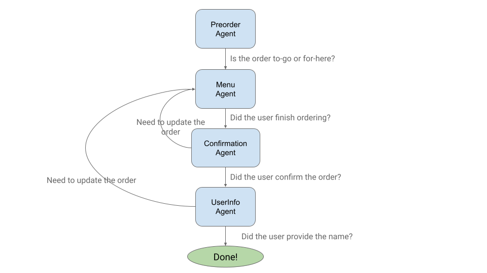
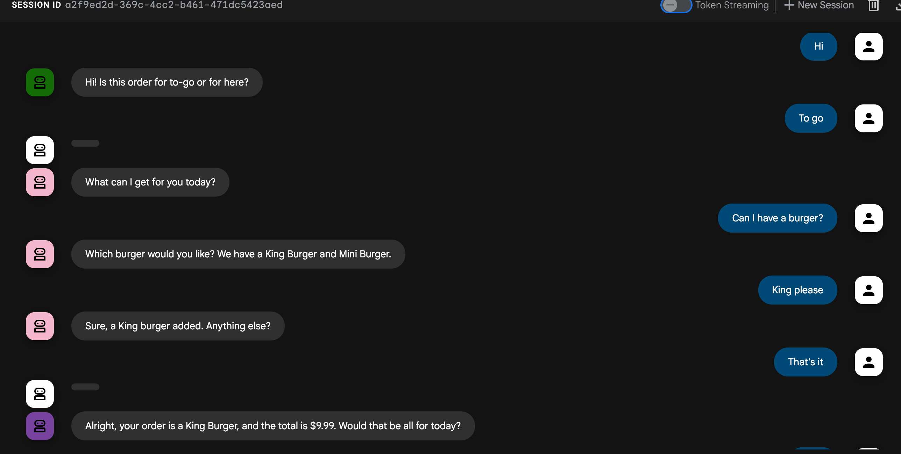
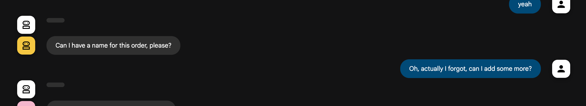
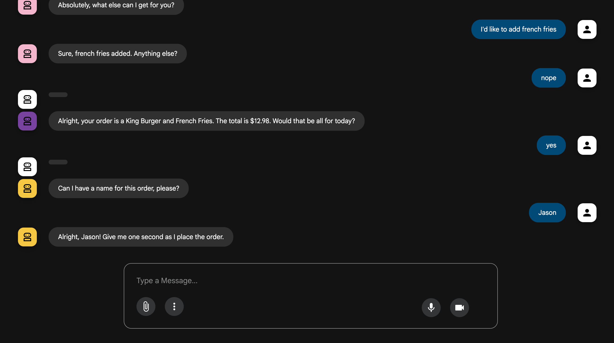

# Customer Order Assistant

## Overview

This repository contains the implementation of a conversational AI assistant designed to streamline the customer ordering food items. The assistant can understand and process customer orders in natural language, making it suitable for various voice- and text-based channels.

Potential applications for this assistant include:
*   **Food Ordering At Kiosk**: Providing a conversational interface for customers to place orders directly at a self-service kiosk.
*   **Automated Drive-Through Ordering**: Integrating with drive-through systems to take orders, reducing wait times and improving order accuracy.
*   **Phone-Based Ordering**: Handling inbound calls to take food orders, freeing up staff and ensuring a consistent customer experience.

**_NOTE:_** While this implementation focuses on food ordering, it can be easily generalized to take orders for other items.

## Technical Design

### Modular

The agent system is designed in a modular fashion, breaking down the food ordering process into a series of specialized sub-agents. Each agent is responsible for a distinct part of the conversation:

*   The `preorder_agent` initiates the interaction and gathers preliminary details.
*   The `menu_agent` focuses on taking the customer's food and drink orders.
*   The `confirmation_agent` summarizes the order to ensure accuracy and confirms with the customer.
*   The `user_info_agent` collects necessary customer details to finalize the order.

This modular design creates a clear and manageable workflow with several key benefits:
*   **Maintainability**: Developers can work on, test, and improve each conversational component independently, leading to a more robust system.
*   **Flexibility**: New use cases can be easily adopted in the future by composing or replacing existing sub-agents.

### Custom Workflow Agent

To create a predictable, low-latency conversational flow, this system uses a `CustomWorkflowAgent` to orchestrate the sub-agents. Instead of using an LLM to decide which agent to use next, it employs a deterministic, rule-based approach.

As seen in `agents/order_flow_agent.py`, a `get_next_agent` function inspects the `session_state` (e.g., `ORDER_TYPE`, `ORDER_STATUS`) to decide which specialized agent should handle the next turn. This state-driven logic ensures efficient and reliable transitions between sub-agents, decoupling the agent decision logic from the specific sub-agent implementation.


#### Agent Workflow Diagram


### Structured Outputs

To keep response latency low, the agents are designed to return structured JSON outputs consisting of the agent response and other fields indicating the state of the order processing. This allows the system to perform multiple operations—like updating session state and preparing the next user response—in a single, parallel step without needing additional LLM calls.

For example, a sub-agent, such as the `preorder_agent` in `agents/preorder_agent/agent.py` and the `menu_agent` in `agents/menu_agent/menu_agent.py`, defines an `OutputSchema` using Pydantic. For instance, the `menu_agent`'s schema includes fields for `agent_response`, `order_update`, and `order_finished`.

An `AfterModelCallback` function in each agent parses the LLM's JSON output. It then uses this structured data to deterministically update the session state (e.g., `ORDER_STATUS`) and formulate the exact text to return to the user. This approach avoids unpredictable text parsing and minimizes LLM calls, ensuring a faster and reliable user experience.

## Environment Setup

```
$ cp .env.example .env

# Provide the specific values for the environment variables
$ nano .env

# Set the environment variables
$ source .env
```

## Run Locally

```
# Set up venv
$ python3 -m venv venv
$ source venv/bin/activate

# Install dependencies
$ pip install -r requirements.txt

# Run adk web
$ adk web --trace_to_cloud .
```

## Deploy in Agent Engine

```
$ python3 deployment/deploy.py
```

## Example Conversation



